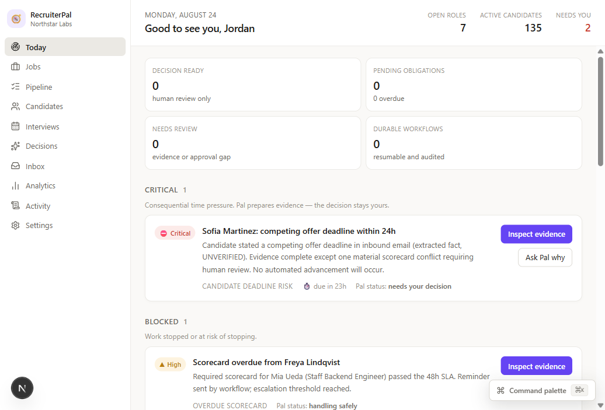
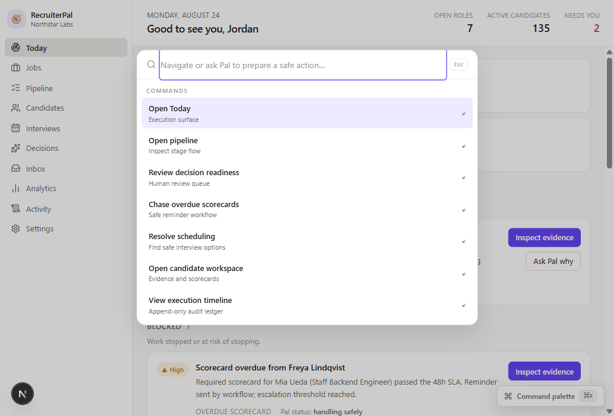
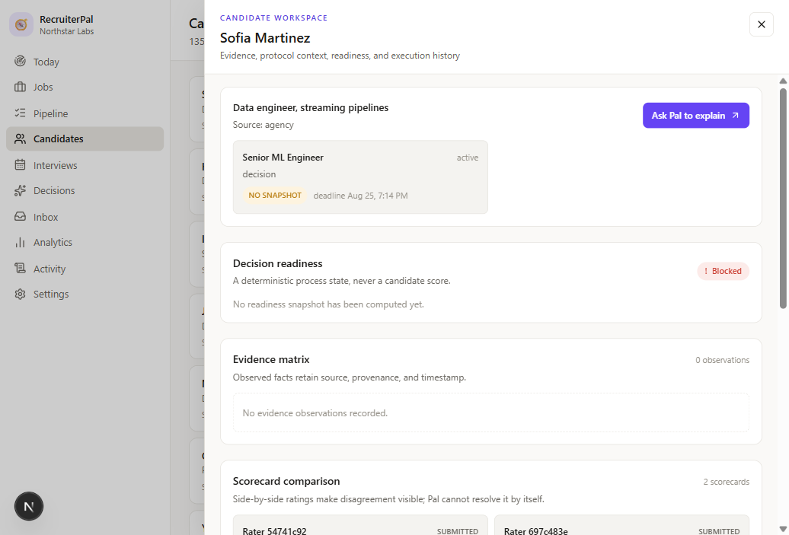

# RecruiterPal

**The evidence-centered recruiting operating system, powered by Pal.**

RecruiterPal gives recruiting teams one execution surface for the work that
usually disappears between an ATS, email, calendars, spreadsheets, and human
memory. It turns hiring protocols, candidate evidence, scorecards, deadlines,
approvals, and operational risk into a living recruiting portfolio.

Pal is RecruiterPal's bounded execution agent. Pal understands the current
organization, job, candidate, application, workflow, evidence, permissions,
and deadlines. It surfaces what matters, explains why it matters, prepares
safe administrative work, and asks for human approval whenever a consequential
employment decision is involved.

RecruiterPal is built for teams that want recruiting to move faster without
turning judgment into an opaque model output.

## See the product

These screens use the deterministic Northstar Labs demo world shipped with the
repository. They show the product in its intended operating mode: dense,
quiet, evidence-first, and designed around action rather than a chat bubble.

### Today: the recruiting execution surface

Today opens with the portfolio state a recruiter needs right now: critical
deadlines, blocked processes, overdue scorecards, pipeline signals, decision
readiness, and work Pal has safely completed.



### Command palette: keyboard-first control

`⌘K` / `Ctrl+K` turns navigation and safe agentic actions into one command
surface. Recruiters can open the right context, inspect evidence, chase an
overdue scorecard, resolve scheduling, review readiness, or open the execution
timeline without restating the current portfolio context.



### Candidate workspace: evidence before inference

The candidate workspace keeps protocol context, decision readiness, evidence
observations, scorecard comparison, and execution history together. It does
not produce a hidden fit score or let Pal make the hiring call.



## What RecruiterPal does

- **Runs the day.** Today is an execution control surface, not a generic ATS
  dashboard. It tells the team what is urgent, blocked, overdue, drifting, or
  ready for a human decision.
- **Keeps evidence attached to judgment.** Versioned hiring protocols,
  structured observations, source provenance, scorecards, conflicts, and
  readiness snapshots make the reasoning inspectable.
- **Lets Pal do the coordination.** Pal can read portfolio state, explain
  evidence, request reminders, prepare debriefs, draft communications, and
  propose safe next steps through bounded typed tools.
- **Makes workflows durable.** Scorecard chase, candidate follow-up,
  scheduling resolution, interviewer replacement, reconciliation, stale-state
  handling, and deadline escalation are deterministic, retry-safe, resumable,
  and audit-producing.
- **Keeps authority human.** Pal can prepare and propose. Humans retain the
  authority to advance consequential decisions, reject candidates, and hire.
- **Works from keyboard or mouse.** Command navigation, contextual drawers,
  inline actions, semantic state badges, accessible controls, and reduced-motion
  support are part of the product surface.

## The Pal operating model

```text
PostgreSQL canonical truth
          ↓
Deterministic domain rules, permissions, calculations, and mutations
          ↓
Vercel Workflow durable orchestration
          ↓
Eve bounded interpretation, tools, skills, proposals, and HITL
          ↓
OpenCode Go → GPT-5.6 Luna model runtime
          ↓
Contextual UI intents and human-approved execution
```

The model never owns business state. PostgreSQL owns canonical truth.
Deterministic domain code owns authorization, invariants, state transitions,
calculations, and mutations. Vercel Workflow owns durable deterministic
processes. Eve owns bounded agent behavior. Humans retain consequential
employment authority.

## Technology stack

| Area               | Technology                                                   | Role in RecruiterPal                                                             |
| ------------------ | ------------------------------------------------------------ | -------------------------------------------------------------------------------- |
| Web application    | Next.js `16.3.2` App Router                                  | Server-rendered product surfaces, route handlers, and workflow endpoints         |
| UI runtime         | React `19.2.8`                                               | Interactive recruiting workspace and contextual agent surfaces                   |
| Language           | TypeScript `5.9.3` strict mode                               | Typed contracts across UI, domain, workflows, integrations, and agent boundaries |
| Product system     | Turborepo `2.10.11` + pnpm `10.17.1`                         | Fast, explicit monorepo orchestration                                            |
| Agent framework    | Eve `0.44.3`                                                 | `defineAgent()`, Pal sessions, skills, tools, subagents, proposals, and HITL     |
| Agent adapter      | `@ai-sdk/openai` `4.0.46`                                    | Server-only Responses-compatible provider boundary                               |
| Model provider     | OpenCode Go                                                  | `https://opencode.ai/zen/go/v1`, Responses protocol, `gpt-5.6-luna`              |
| Durable execution  | Vercel Workflow SDK `4.8.4`                                  | Durable, resumable, retry-safe recruiting workflows                              |
| Database           | PostgreSQL 18 / Neon-compatible                              | Canonical application state, event history, audit ledger, and tenant boundaries  |
| ORM and migrations | Drizzle ORM `0.45.2` + Drizzle Kit `0.31.10`                 | Schema, migrations, repositories, and RLS-aware data access                      |
| Authentication     | Better Auth `1.7.1`                                          | Email/password auth, organization plugin, sessions, roles, and permissions       |
| Styling            | Tailwind CSS `4.3.3`                                         | Warm-neutral design tokens, state semantics, dark mode, and responsive layout    |
| Components         | shadcn/ui-class primitives + Radix-style accessible patterns | Quiet, composable interface primitives and keyboard behavior                     |
| Motion             | Motion `13.1.1`                                              | Restrained spatial and lifecycle transitions with reduced-motion support         |
| Icons              | lucide-react                                                 | Consistent, accessible product iconography                                       |
| Integrations       | Gmail and Google Calendar adapter boundaries                 | Explicit live-provider contracts with safe synthetic fallbacks                   |
| Quality            | Vitest, Playwright `1.62.1`, Lefthook `1.13.6`               | Unit, contract, DB/RLS, workflow, agent-eval, browser, and pre-push gates        |
| Delivery           | GitHub Actions                                               | Full quality and golden-flow qualification on every `main` push                  |

Python is intentionally not part of the runtime. RecruiterPal keeps the
application deterministic; statistical signals are computed in TypeScript
where the contract does not require probabilistic inference.

## Safety and governance by design

RecruiterPal is deliberately opinionated about what an agent must never do:

- Pal never auto-rejects or auto-hires a candidate.
- Pal never owns a hidden candidate ranking, arbitrary fit score, personality
  inference, facial or emotion analysis, accent analysis, or culture-fit proxy.
- Protected demographics are segregated from selection evidence and scoring.
- Every agent tool checks organization, actor, role, permission, resource,
  authority class, typed input, and domain invariants.
- Eve never receives raw database credentials and never writes direct SQL.
- Consequential mutations require human authority, approval-aware proposals,
  immutable domain events, and append-only audit records.
- PostgreSQL RLS is fail-closed; cross-tenant reads, updates, deletes, and
  invalid inserts are rejected.
- Unsupported evidence is reported as missing or uncertain. It is never
  invented to make a candidate appear more complete.

## The deterministic Northstar Labs demo

The seeded demo world is designed to make the product's operating model
visible, not to simulate a superficial happy path. It includes:

- a final-stage candidate facing a competing-offer deadline;
- incomplete evidence and a material rating disagreement;
- overdue scorecards that trigger idempotent reminders and escalation;
- protocol and requirement drift without silently reinterpreting prior
  evidence;
- actionable exceptions, decision-readiness states, and audit history;
- Pal recognizing urgency and preparing safe actions while a human remains
  responsible for the consequential call.

All committed demo data is synthetic and generated by deterministic seed
generators for Northstar Labs. No real candidate PII is committed.

## Run it locally

Requirements: Node.js 24+, pnpm 10, and Docker (or a local PostgreSQL 18
instance).

```bash
pnpm install
cp .env.example .env.local
pnpm db:migrate
pnpm db:seed
pnpm dev
```

Open [http://localhost:3000/login](http://localhost:3000/login), then choose
the seeded **Recruiting Lead** demo account. The app works in deterministic
mode without a model key. To enable live Pal turns, add
`OPENCODE_GO_API_KEY` to the server environment; the secret is never exposed
to the browser.

## Repository map

```text
apps/web/                  Next.js product, routes, server actions, and UI composition
packages/domain/           State machines, SLA math, readiness, authority, and invariants
packages/db/               Drizzle schema, migrations, RLS, repositories, and seed generator
packages/auth/             Better Auth, organization context, sessions, and RBAC
packages/application/      Authorized deterministic mutation boundary
packages/agent-runtime/    Eve adapter, Pal tools, sessions, proposals, events, and HITL
packages/workflows/        Durable workflow plans, entrypoints, retry and idempotency logic
packages/integrations/     Gmail / Google Calendar boundaries and synthetic adapters
packages/contracts/        Typed UI intents, Pal responses, proposals, and cross-boundary schemas
packages/ui/               Shared accessible design-system components
packages/observability/    Audit ledger and operational telemetry helpers
agent/                     Pal instructions, skills, tools, and specialist topology
evals/                     Agent authority, privacy, evidence, and tenant-isolation evals
e2e/                       Playwright golden product flows
docs/build-contract/       Frozen implementation authority and acceptance matrix
docs/screenshots/          README product screenshots captured from the local app
scripts/                   Deterministic QA, security, provenance, and local DB utilities
```

## Quality gates

The repository is built to fail closed at the same seams it promises to
protect. The mandatory local pre-push path runs:

```bash
pnpm qa:fast
```

That path covers formatting, lint, TypeScript, unit and contract tests,
real-Postgres qualification, RLS isolation, workflow retries and idempotency,
Eve safety evals, dependency audit, clean-room scan, secret scan, and the
production build. GitHub Actions adds the Playwright golden flow.

See the exact release status, milestone SHAs, provider qualification, and
known limitations in [SHIP_RECEIPT.md](./SHIP_RECEIPT.md).

## License

MIT — see [LICENSE](./LICENSE).
